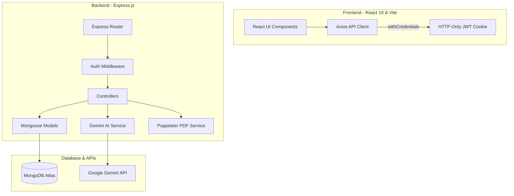

# Interview AI 🚀
> An AI-Powered Resume Analyzer, ATS Optimizer, and Mock Interview Simulator.

[](https://react.dev/)
[](https://expressjs.com/)
[](https://www.mongodb.com/)
[](https://deepmind.google/technologies/gemini/)
[](https://pptr.dev/)

**Interview AI** is a professional, full-stack web application built to help job seekers align their profiles with specific job descriptions. The system parses uploaded resumes, calculates match scores, highlights critical skill gaps, creates customized daily study plans, evaluates practice mock interviews in real-time, and generates tailored resumes exported as clean, ATS-compliant PDFs.

---

## 🌟 Key Technical Highlights (What Recruiters Love)

*   **Strictly Structured LLM Outputs**: Leverages the official `@google/genai` Node.js SDK and Gemini API model configurations. Uses **Zod Schema validation** and `zod-to-json-schema` to enforce type-safe JSON API outputs directly matching the Mongoose database layer, eliminating prompt parsing exceptions.
*   **Headless PDF Engine (ATS-Friendly)**: Dynamically tailors a candidate's background into customized HTML/CSS resumes based on target JDs. Uses **Puppeteer** server-side to compile content to vector PDFs, preserving text selection and searchability for applicant tracking systems.
*   **Stateless Cookie-Based Session Security**: Implements stateless JWT authentication. Tokens are stored in secure **HTTP-Only cookies** to protect against Cross-Site Scripting (XSS) attacks. Requests transmit cookies automatically using Axios `withCredentials` settings.
*   **Revocation Blacklist**: Tracks logged-out sessions via a MongoDB collection with automated **Time-To-Live (TTL) indexes**, purging expired sessions automatically.
*   **Mobile Responsiveness & Premium Design**: Built with a responsive grid layout using Sass variables and breakpoints. Automatically collapses the navigation sidebar into an off-canvas drawer on mobile screens (width $\le$ 768px) with a custom backdrop dismiss system and hamburger toggle button.
*   **Custom React Modals**: Avoids native browser dialogs in favor of custom-designed confirmation modals for destructive events like **Sign Out**, **Delete Account**, and **Delete Report**, guaranteeing consistent UX.

---

## 🛠️ Technology Stack

| Layer | Technologies |
| :--- | :--- |
| **Frontend** | React 19, Vite, React Router v7, Sass (SCSS), Framer Motion, Axios |
| **Backend** | Node.js, Express.js, Multer (multipart file upload), pdf-parse |
| **Database** | MongoDB, Mongoose ODM |
| **AI & PDF** | Google Gemini (`gemini-3-flash-preview`), Puppeteer (headless browser PDF generation) |

---

## 📐 System Architecture & Data Flow



---

## 📂 Project Structure

```text
├── Backend/               # Express server, controllers, models, and AI services
│   ├── src/
│   │   ├── config/        # Database connections and DNS configuration
│   │   ├── controllers/   # Route controller handlers
│   │   ├── middlewares/   # JWT verification and Multer file upload filters
│   │   ├── models/        # Mongoose User, Blacklist, and Report schemas
│   │   ├── routes/        # Router endpoint mappings
│   │   └── services/      # Gemini API wrappers and Puppeteer engines
│   └── server.js          # App entry point
├── Frontend/              # React frontend
│   ├── src/
│   │   ├── components/    # Reusable components (Sidebar, Header, Layouts)
│   │   ├── features/      # Feature-based folder structure (Auth, Interview)
│   │   ├── hooks/         # Custom React hooks (useAuth, useInterview)
│   │   ├── pages/         # Primary application pages (Settings, Reports, History)
│   │   ├── style/         # Global SCSS files
│   │   └── main.jsx       # App entry and routing config
│   └── vite.config.js     # Build/Dev server configurations
└── README.md              # Main project documentation
```

---

## ⚙️ Local Setup Guide

Follow these steps to run the client and server applications on your local machine.

### Prerequisites
*   Node.js (v18.x or above recommended)
*   MongoDB instance (local or MongoDB Atlas cluster)

### 1. Configure the Backend
Navigate to the backend directory, install packages, and set up your environment variables:

```bash
cd Backend
npm install
```

Create a `.env` file in the `Backend/` folder and insert your credentials:
```env
MONGO_URI=your_mongodb_connection_string
GOOGLE_GENAI_API_KEY=your_gemini_api_key
JWT_SECRET=your_custom_jwt_secret_key
PORT=3000
```

Start the backend server in development mode (runs on port `3000`):
```bash
npm run dev
```

### 2. Configure the Frontend
Open a new terminal window, navigate to the frontend directory, install packages, and start the development server:

```bash
cd Frontend
npm install
npm run dev
```
The client application will run on: **`http://localhost:5173/`**

---

## 🔄 Core Workflows & Data Flow

1.  **Authentication**: The browser requests access to private routes. `Protected.jsx` checks the React state. If unauthenticated, it redirects the user to `/login`. Upon successful login, the backend issues an HTTP-Only cookie containing the signed JWT.
2.  **Report Generation**: The user uploads a resume PDF and enters a job description. The backend extracts text using `pdf-parse` and sends it to the Gemini API alongside target criteria. Gemini computes a compatibility report in JSON structure, which is stored in MongoDB and returned to the UI.
3.  **PDF Resumes**: The user clicks "Download Resume" in the report view. The backend generates custom HTML highlighting target keywords, compiles the page into a PDF buffer using Puppeteer, and sends the stream as a downloadable attachment.
4.  **Practice Evaluation**: During mock interviews, user answers are sent to the backend `/api/interview/evaluate` endpoint. Gemini evaluates the response, scores it against correct answer metrics, and suggests specific improvements.
